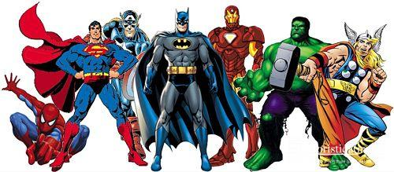

```{r setup, include=FALSE}
knitr::opts_chunk$set(cache = TRUE, message = FALSE, warning = FALSE)

library(readr)
library(tidyr)
library(dplyr)
library(ggplot2)
```

# Introduzione

```{r, message=FALSE, warning=FALSE, echo=FALSE}
heroes = read.csv("heroes_information.csv")
powers = read.csv("super_hero_powers.csv")
```

## Introduzione

<div style="text-align:center"></div>

I **supereroi** hanno popolato la nostra vita, sin dall'infanzia.
Infatti è difficile sentir parlare di *Superman* o di *Joker* e non sapere chi siano.
Ma quali sono le dinamiche all'interno dei fumetti?
Cos'è che fa, effettivamente, trionfare il bene?
Serve avere tanti poteri?
E, soprattutto, ci hanno sempre insegnato che una persona intelligente è una persona che avrà sempre le porte aperte nella vita. Ma siamo sicuri che sia sempre così?

Ho provato a entrare nella mente delle varie case produttrici di fumetti, concentrandomi soprattutto su quanto ritengano sia decisiva l'intelligenza per trionfare.
Inoltre ho rapportato l'intelligenza a vari aspetti dei personaggi, come il sesso, la razza e l'orientamento (cattivi, buoni o neutrali).

ATTENZIONE: con la parola *supereroe* farò riferimento sia ai personaggi buoni, sia a quelli malvagi.

## Per cominciare

Le due case editrici di fumetti più famose sono, senza dubbio, la **DC Comics** e la **Marvel Comics**.
Ma quale dei due universi ha il maggior numero di supereroi?

```{r, message=FALSE, warning=FALSE, echo=FALSE}
# togliere tutte le altezze negative (-99) e sostituirle con NA
# togliere tutti i pesi negativi (-99) e sostituirli con NA
# sostituire i "-" in Gender, Eye.color, Race, Hair.color, Skin.color, Alignment con NA
# sostituire gli spazi mancanti in Publisher con NA

heroes$Height[heroes$Height == "-99"] <- NA
heroes$Weight[heroes$Weight == "-99"] <- NA

heroes$Gender[heroes$Gender == "-"] <- NA
heroes$Eye.color[heroes$Eye.color == "-"] <- NA
heroes$Race[heroes$Race == "-"] <- NA
heroes$Hair.color[heroes$Hair.color == "-"] <- NA
heroes$Skin.color[heroes$Skin.color == "-"] <- NA
heroes$Alignment[heroes$Alignment == "-"] <- NA

heroes$Publisher[heroes$Publisher == "" ] <- NA

# rendere BOOLEAN i poteri, tranne ovviamente la prima colonna
powers[, -1] <- lapply(powers[, -1], as.logical)

# togliere in heroes la colonna con gli indici
heroes <- heroes[, -1]
```

```{r, message=FALSE, warning=FALSE, echo=FALSE}
# numero di super eroi per casa editrice

heroes$Publisher <- factor(heroes$Publisher,
                           levels = names(sort(table(heroes$Publisher), decreasing = TRUE)) )

ggplot(heroes) + 
  geom_histogram(aes(x = Publisher, fill = Publisher), stat = "count") +   #ho usato count perchè i dati sono discreti
  labs(title = "Number of superheroes per publisher", x = "Publishers", y = "Superheroes") +
  theme_classic() +
  theme(axis.text.x = element_text(angle = 90),
        legend.title = element_blank(),
        plot.title = element_text(size = 15, face = "bold"))
```

Dal grafico possiamo notare che la Marvel, seppur più "giovane" della DC di ben 5 anni, ha quasi il doppio dei suoi supereroi.

Considerato che le altre case editrici hanno un numero davvero irrisorio di personaggi rispetto ai due Universi più famosi, da ora in poi verranno raggruppate sotto il nome di **Other**.

## Close-up sui supereroi Marvel e DC Comics

```{r, message=FALSE, warning=FALSE, echo=FALSE}
# faccio un close-up sui supereroi Marvel e DC comix poichè sono gli universi col maggior numero di super eroi

# creo una nuova colonna in cui sostituisco le case editrici diverse da Marvel e DC con "other"
# per farlo devo prima farli diventare character, poi fare la modifica e in seguito ritrasformarli in fattori

heroes$PubModificati <- as.character(heroes$Publisher)
heroes$PubModificati[!(heroes$PubModificati %in% c("DC Comics", "Marvel Comics"))] = "Other"
heroes$PubModificati <- factor(heroes$PubModificati, levels = c("Marvel Comics","DC Comics","Other"))

ggplot(heroes) + 
  geom_histogram(aes(x = PubModificati, fill = PubModificati), stat = "count") +
  labs(title = "Close-up on Marvel and DC Comics", x = "Publisher", y = "Superheroes") +
  theme_classic() +
  theme(legend.title = element_blank(),
        plot.title = element_text(size = 15, face = "bold")) +
  scale_fill_manual(values = c("#E41A1C", "#377EB8", "grey"))
```

# Serve avere tanti poteri per vincere?

## Distribuzione dei poteri

**Serve avere tanti poteri per vincere?**

Bene, per rispondere a questa domanda ho deformato il grafico precedente, in base al numero di supereroi che hanno una certa quantità di superpoteri.

```{r, message=FALSE, warning=FALSE, echo=FALSE}
# creo una colonna total_power nel dataset power, in cui sommo i poteri di ogni singolo supereroe
powers <- powers %>%
  mutate(total_powers = rowSums(.[2:ncol(powers)]))

# unisco ogni super eroe al suo corrispettivo total_power
Cmb <- heroes %>%
  inner_join(powers, by = c("name" = "hero_names")) %>%
  select(name, total_powers, PubModificati)

# numero di poteri per supereroe, basati sull'universo
ggplot(Cmb) +
  geom_violin(aes(x = PubModificati, y = total_powers ,fill= PubModificati)) +
  labs(title = "Distribution of superpowers per superhero", x = "Publisher", y = "Superpowers") +
  theme_bw() +
  theme(legend.position = "none", 
        plot.title = element_text(size = 15, face = "bold")) +
  scale_fill_manual(values = c("#E41A1C", "#377EB8", "grey"))
```

Ad una prima analisi noto che la DC è quella che si sviluppa più in altezza, con un supereroe che arriva a possedere il record di **49 superpoteri**, seguito dalla Marvel.
Noto invece che le altre case editrici tendono a dare ad ogni supereroe un solo potere, probabilmente per rendere ogni personaggio unico nel suo genere.

Ma vediamo più in dettaglio i supereroi che hanno il maggior numero di poteri.

## Classifica dei supereroi col maggior numero di poteri

```{r, message=FALSE, warning=FALSE, echo=FALSE}
# super eroi che hanno più poteri
Most_powerful_heroes <- Cmb %>%
  arrange(desc(total_powers)) %>%
  head(25)

Most_powerful_heroes %>%
  ggplot(aes(x = reorder(name, total_powers), y = total_powers, fill = PubModificati)) +
  geom_bar(stat = "identity") + 
  geom_text(aes(label = total_powers), hjust = -0.3, size = 3, color = "black") +
  labs(title = "Most power-full Superheroes", x = "Name", y = "Number of Superpowers") +
  theme_classic() +
  theme(legend.title = element_blank(), 
        plot.title = element_text(size = 15, face = "bold")) +
  scale_fill_manual(values = c("#E41A1C", "#377EB8", "grey")) +
  coord_flip()
```

La prima cosa che salta all'occhio, e che di primo acchito sembra un errore, è la predenza di **due Captain Marvel**, una appartenente alla Marvel Comics e l'altro alla DC Comics.
La spiegazione è che quello della DC è stato "creato" prima prima che la Marvel nascesse. Nei fumetti quindi venne chiamato "Captain Marvel", ma per problemi di copyright, la casa editrice decise di cambiargli il nome in "Shazam".

I risultati parlano chiaro: visti i personaggi che sono tra i primi in lista, e visto come si concludono i film in cui sono presenti, è lampante concludere che **non è importante il numero di poteri per vincere**.

# Quanto è valutata l'intelligenza nei fumetti?

## I poteri più quotati in un supereroe medio

Ho deciso di graficare il numero di supereroi che hanno determinati poteri, per poter capire in che posizione sia l'intelligenza:

```{r, message=FALSE, warning=FALSE, echo=FALSE}
# poteri più comuni tra i super eroi

Powers_Folder <- heroes %>%
  select(name, PubModificati) %>%
  inner_join(powers, by = c("name" = "hero_names"))  %>%
  gather(power, power_count, -name, -PubModificati)

Common_powers <- Powers_Folder %>%
  group_by(power, PubModificati) %>%
  summarise(powers_used_by = sum(power_count)) %>%
  arrange(desc(powers_used_by)) %>%
  filter(powers_used_by < 800) %>%   # per escludere la riga dei "total_powers"
  group_by(power) %>%
  mutate(powers_in_total = sum(powers_used_by)) %>%
  ungroup()

Common_powers %>%
  filter(powers_in_total >= 100) %>%
  ggplot(aes(x = reorder(power, powers_in_total) , y = powers_used_by, fill = PubModificati)) +
  geom_bar(stat = "identity", position = "dodge") +
  labs(title = "Most common Superpowers", x = "Powers", y = "Number of Superheroes") +
  theme_classic() +
  theme(legend.title = element_blank(),
        plot.title = element_text(size = 15, face = "bold")) +
  theme(axis.text.x = element_text(angle = 90)) +
  scale_fill_manual(values = c("#E41A1C", "#377EB8", "Grey"))

```

Dal grafico sembra che ai primi posti ci siano abilità prettamente **fisiche**, come la forza, la resistenza e la stamina.
Quindi è lampante che le case editrici tendano a promuovere forza bruta e violenza come la soluzione per ottenere la vittoria.

L'intelligenza non è sul podio, ma è interessante notare come essa, assieme alla furtività, sia più accentuata nei supereroi dell'universo DC, risultato ancora più sorprendente considerato che la DC ha quasi la metà dei supereroi della Marvel.

# Qual è la casa editrice che dà maggior peso all'intelligenza?

## Prime conclusioni

La casa editrice che dà maggior peso all'intelligenza sembra sia la DC Comics, ma per esserne sicuri andrò a rapportare l'intelligenza a varie caratteristiche come:

> 1. Orientamento
> 1. Sesso
> 1. Razza

e andremo a vedere come si comportano le case editrici per ogni singola caratteristica.

# Orientamento: sono più intelligenti i buoni o i cattivi?

## Intelligenza & Orientamento

Per prima cosa andiamo ad analizzare l'orientamento globale dei supereroi:

```{r, message=FALSE, warning=FALSE, echo=FALSE}
# grafico sul'orientamento buono o cattivo dei vari super eroi

ggplot(heroes %>% filter(!is.na(Alignment))) + 
  geom_histogram(aes(x = Alignment, fill = Alignment), stat = "count") +
  scale_fill_manual(values = c("#8D42D4", "#95D442", "gray")) +
  labs(title = "Global alignment", x = "Alignment", y = "Number of Superheroes") +
  theme_classic() +
  theme(legend.title = element_blank(),
        plot.title = element_text(size = 15, face = "bold"))
```

Come potevamo aspettarci i supereroi buoni superano del 150% quelli cattivi.
Prevedibile.

Se però facciamo un close-up sull'orientamento dei supereroi intelligenti, la situazione sembra essere meno prevedibile:

```{r, message=FALSE, warning=FALSE, echo=FALSE}
# creo un dataframe di eroi intelligenti, con all'interno le caratteristiche utili per fare vari confronti

Intelligent_heroes <- heroes %>%
  inner_join(powers, by = c("name" = "hero_names")) %>%
  filter(Intelligence == TRUE) %>%
  select(name, Gender, Race, PubModificati, Publisher, Alignment, Intelligence, Height, Weight)

# grafico sull'orientamento buono o cattivo dei vari super eroi intelligenti

ggplot(Intelligent_heroes %>% filter(!is.na(Alignment)) ) + 
  geom_histogram(aes(x = Alignment, fill = Alignment), stat = "count") +
  scale_fill_manual(values = c("#8D42D4", "#95D442", "gray")) +
  labs(title = "Alignment of intelligent superheroes", x = "Alignment", y = "Number of Superheroes") +
  theme_classic() +
  theme(legend.title = element_blank(),
        plot.title = element_text(size = 15, face = "bold"))
```

Ovviamente i buoni sono sempre la maggioranza **sebbene** la percentuale dei cattivi e dei neutrali pare aumentata.
Infatti il divario tra buoni e cattivi-neutrali sembra diminuire di molto, arrivando ad una differenza di solo il 67%.

Quindi chi è più intelligente è più probabile che tenda a schierarsi "on the dark side", o comunque tende a rimanere neutrale (probabilmente prendendo posizione in una delle due parti a seconda della convenienza). 

**Sembra quasi che l'intelligenza sia una dote "oscura", quindi vista in modo negativo**.

Infine, analizziamo il grafico dell'orientamento dei supereroi, suddividendoli per casa editrice:

```{r, message=FALSE, warning=FALSE, echo=FALSE}
# grafico sull'orientamento buono o cattivo dei vari super eroi intelligenti basandosi sulla casa editrice

ggplot(Intelligent_heroes %>% filter(!is.na(Alignment)) ) + 
  geom_histogram(aes(x = Alignment, fill = Alignment), stat = "count") + 
  scale_fill_manual(values = c("#8D42D4", "#95D442", "gray")) +
  labs(title = "Alignment of intelligent superheroes per publisher", x = "Alignment", y = "Number of Superheroes") +
  theme_classic() +
  theme(legend.title = element_blank(),
        plot.title = element_text(size = 15, face = "bold")) +
  facet_grid(~PubModificati, scales = "free")

```

Tirando le somme possiamo concludere che la DC comics sia, non solo la casa editrice che attribuisce all'intelligenza un importanza maggiore, ma anche quella che ha il divario fra buoni e cattivi-neutrali più alto.

Quindi si può dire che la DC veda l'intelligenza in modo più positivo rispetto alla Marvel, che fra tutte e quella più bilanciata.

## Quanto è importante l'intelligenza per vincere?

Relativamente poco, perchè come abbiamo visto, è più spiccata nei cattivi.

# Sesso: sono più intelligenti i maschi o le femmine?

## Intelligenza & Sesso dei personaggi

Anche qui analizzeremo la situazione globale, per poi entrare nei particolari:

```{r, message=FALSE, warning=FALSE, echo=FALSE}
# grafico sul sesso dei vari super eroi

ggplot(heroes %>% filter(!is.na(Gender))) + 
  geom_histogram(aes(x = Gender, fill = Gender), stat = "count") +
  scale_fill_manual(values = c("#FFD3CC", "#CCFCFF")) +
  labs(title = "Global gender distribution", x = "Gender", y = "Number of Superheroes") +
  theme_classic() +
  theme(legend.title = element_blank(),
        plot.title = element_text(size = 15, face = "bold"))
```

Così come per l'orientamento, anche per il genere abbiamo un netto vantaggio dei maschi, che sono il 150% di più delle femmine.
Prevedibile.
In altre parole, il bilanciamento globale di genere è: **71% maschi e 29% femmine**.

```{r, message=FALSE, warning=FALSE, echo=FALSE}
# grafico sul sesso dei supereroi intelligenti

ggplot(Intelligent_heroes %>% filter(!is.na(Gender)) ) + 
  geom_histogram(aes(x = Gender, fill = Gender), stat = "count") +
  scale_fill_manual(values = c("#FFD3CC", "#CCFCFF")) +
  labs(title = "Gender of intelligent superheroes", x = "Gender", y = "Number of Superheroes") +
  theme_classic() +
  theme(legend.title = element_blank(),
        plot.title = element_text(size = 15, face = "bold"))
```

Però, a differenza del corrispettivo grafico dell'orientamento (in cui il divario diminuiva), in questo la disparità tra maschi e femmine sembra aumentare, fino a sfiorare il 200%.
Quindi il bilanciamento globale di genere degli intelligenti è: **75% maschi e 25% femmine**.

Proviamo a vedere quali case editrici sono le più "maschiliste" *(sarcasm flag)*:

```{r, message=FALSE, warning=FALSE, echo=FALSE}
# grafico sul sesso dei vari super eroi intelligenti basandosi sulla casa editrice

Intelligent_heroes %>% 
  filter(!is.na(Gender)) %>% 
  ggplot(mapping = aes(x = PubModificati, fill = Gender)) + 
  geom_bar(position = "fill") + 
  scale_fill_manual(values = c("#FFD3CC", "#CCFCFF")) +
  labs(title = "Gender of intelligent superheroes per publisher", x = "Publisher", y = "Gender") +
  theme_classic() +
  theme(legend.title = element_blank(),
        plot.title = element_text(size = 15, face = "bold")) +
  coord_flip()

```

Marvel e DC sono le più bilanciate, sebbene a svantaggio femminile (73% maschi e 27% femmine), mentre le più sbilanciate sembrano essere le altre case editrici.

Individuo tra le altre case, quelle che hanno super intelligenti e vado a confrontare i risultati ottenuti con la panoramica globale.
Vediamolo più in dettaglio:

```{r, message=FALSE, warning=FALSE, echo=FALSE}
# close up del sesso su "other" in heroes

heroes %>% 
  filter(!is.na(Gender)) %>% 
  filter(Publisher != "Marvel Comics") %>%
  filter(Publisher != "DC Comics") %>%
  ggplot(mapping = aes(x = Publisher, fill = Gender)) + 
  geom_bar(position = "fill") + 
  scale_fill_manual(values = c("#FFD3CC", "#CCFCFF")) +
  labs(title = "Close-up on the gender distribution in Other", x = "Publisher", y = "Gender") +
  theme_classic() +
  theme(legend.title = element_blank(),
        plot.title = element_text(size = 15, face = "bold")) +
  coord_flip()


# close up del sesso su "other" in Intelligent_heroes

Intelligent_heroes %>% 
  filter(!is.na(Gender)) %>% 
  filter(Publisher != "Marvel Comics") %>%
  filter(Publisher != "DC Comics") %>%
  ggplot(mapping = aes(x = Publisher, fill = Gender)) + 
  geom_bar(position = "fill") + 
  scale_fill_manual(values = c("#FFD3CC", "#CCFCFF")) +
  labs(title = "Close-up on the gender of intelligent superheroes in Other", x = "Publisher", y = "Gender") +
  theme_classic() +
  theme(legend.title = element_blank(),
        plot.title = element_text(size = 15, face = "bold")) +
  coord_flip()

```

Poiché sono case di "piccolo calibro", alcune non hanno supereroi femmine, questa potrebbe essere una delle cause dello sbilanciamento.

*Ricordando che il bilanciamento globale di genere degli intelligenti era intorno al 75% vs 25%*

Ho notato alcune situazioni particolari:

* Wildstorm ha un bilanciamento globale di genere migliore, ma **NESSUNO è intelligente**
* Icon Comics ha un bilanciamento globale di genere lievemente peggiore, ma **IL 100% dei supereroi intelligenti sono femmine**
* ABC Studios ha il bilanciamento globale di genere migliore (50% vs 50%) ma **IL 100% dei supereroi intelligenti sono maschi**
* Startrek è il più coerente, assieme alla Dark Horse Comics (che ha un lievissimo vantaggio per le donne intelligenti, rispetto al suo bilanciamento globale)
* Image Comics e George Lucas sono la case più sbilanciate, e la totalità di intelligenti sono uomini

# Razza: quale razza spicca in intelligenza?

## Intelligenza & Razza

```{r, message=FALSE, warning=FALSE, echo=FALSE}
# grafico sulla razza dei supereroi più intelligenti

ggplot(Intelligent_heroes) + 
  geom_histogram(aes(x = Race, fill = Race), stat = "count") +
  labs(title = "Race of intelligent superheroes", x = "Race", y = "Number of Superheroes") +
  theme_classic() +
  theme(legend.position = "none",
        axis.text.x = element_text(angle = 90),
        plot.title = element_text(size = 15, face = "bold"))

ggplot(heroes) + 
  geom_histogram(aes(x = Race, fill = Race), stat = "count") +
  labs(title = "Superheroes' race", x = "Race", y = "Number of Superheroes") +
  theme_classic() +
  theme(legend.position = "none",
        axis.text.x = element_text(angle = 90),
        plot.title = element_text(size = 15, face = "bold"))
```

Sembra che la razza più intelligente sia l'uomo, seguita dai mutanti e dagli dei, ma è solo un'illusione.
Andando a guardare il grafico globale del numero di individui per razza, infatti, si può notare come la razza umana sia quella più numerosa.

Facendo le proporzioni la classifica viene totalmente ribaltata:
Al primo posto abbiamo gli **dei**, con una percentuale del 69%,
Al secondo posto abbiamo i **mutanti**, con una percentuale del 22%,
E infine gli **uomini**, con una percentuale del 19%

## Case editrici con i non umani più intelligenti

Ho rimosso gli umani perchè, essendo un gran numero, avrebbero riempito di "rumore" i grafici di dispersione e non mi avrebbero permesso di notare eventuali anomalie.

```{r, message=FALSE, warning=FALSE, echo=FALSE}
#Case editrici con i non umani più intelligenti (grafico di dispersione)

Intelligent_heroes %>%
  filter(Race != "Human") %>% 
  filter(!is.na(Height)) %>% 
  filter(!is.na(Weight)) %>% 
  ggplot(mapping = aes(x = Height, y = Weight)) + 
  geom_point() +
  facet_wrap(~Publisher) + 
  labs(title = "The publishers having non-human intelligent heroes") +
  theme_bw() +
  theme(plot.title = element_text(size = 15, face = "bold"))

```

La casa editrice col maggior numero di non-umani intelligenti è la Marvel.

